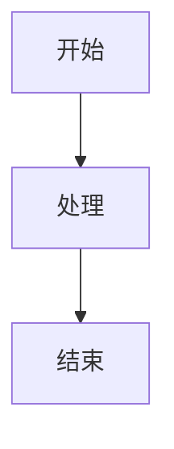

# MarkFlow Lite

> 一个纯前端在线 Markdown 编辑器

[](https://opensource.org/licenses/MIT)

[](https://github.com/blankzsh/markflow-lite/commits/main)
[](https://github.com/blankzsh/markflow-lite/issues)
[](https://github.com/blankzsh/markflow-lite/pulls)
[](https://github.com/blankzsh/markflow-lite/stargazers)
[](https://github.com/blankzsh/markflow-lite/network/members)

<p align="center">
  <a href="README_en.md">English</a> •
  <a href="README_ja.md">日本語</a> •
  <a href="README_es.md">Español</a> •
  <a href="README_pt.md">Português</a> •
  <a href="README_de.md">Deutsch</a>
</p>

MarkFlow Lite 是一个完全运行在浏览器中的纯前端 Markdown 编辑器，无需服务器支持，开箱即用，支持实时编辑、双向预览、本地保存和内容分享。

## 🌟 特性

- ✍️ **实时编辑** - 支持标准 Markdown 语法（含表格、代码块、列表等）
- 👁️ **实时预览** - 边写边看，支持数学公式和流程图渲染
- 💾 **本地存储** - 自动保存草稿到浏览器本地存储
- 📄 **文件导出** - 支持导出为 PDF、HTML、Markdown 等格式
- 📂 **文件管理** - 支持新建文档、打开本地 Markdown 文件
- 🔗 **内容分享** - 生成唯一链接，内容可通过 URL 参数共享
- 🎨 **主题切换** - 提供深色/浅色主题，适配不同阅读环境
- ⌨️ **快捷操作** - 支持常用快捷键（加粗、斜体、标题插入等）
- 📱 **响应式设计** - 支持桌面、平板、手机访问

## 📸 界面预览

<div align="center">
  
  <p><em>MarkFlow Lite 编辑器界面 - 实时编辑和预览功能</em></p>
</div>

<div align="center">
  
  <p><em>MarkFlow Lite 预览界面 - 支持数学公式和流程图渲染</em></p>
</div>

<div align="center">
  
  <p><em>MarkFlow Lite 深色主题 - 舒适的夜间编辑体验</em></p>
</div>

## 🚀 快速开始

[](https://nodejs.org/)
[](https://www.npmjs.com/)

### 在线使用

直接访问 [MarkFlow Lite](https://editor.currso.com) 即可开始使用。

### 本地开发

```bash
# 克隆项目
git clone https://github.com/blankzsh/markflow-lite.git

# 进入项目目录
cd markflow-lite

# 安装依赖
npm install

# 启动开发服务器
npm run dev

# 构建生产版本
npm run build

# 预览生产构建
npm run preview
```

## 🛠️ 技术栈

[](https://reactjs.org/)
[](https://www.typescriptlang.org/)
[](https://vitejs.dev/)
[](https://tailwindcss.com/)
[](https://markdown-it.github.io/)

- **开发框架**: React + TypeScript + Vite
- **Markdown 解析**: markdown-it
- **代码高亮**: Highlight.js
- **样式设计**: Tailwind CSS + @tailwindcss/typography
- **数学公式**: MathJax (通过 markdown-it-mathjax3)
- **流程图支持**: Mermaid
- **构建工具**: Vite
- **部署平台**: GitHub Pages / Vercel / Netlify

## 📖 使用指南

### 基本操作

1. **编辑模式** - 在左侧编辑区域编写 Markdown 内容
2. **预览模式** - 实时查看渲染后的效果
3. **分屏模式** - 同时查看编辑和预览区域

### 快捷键

- `Ctrl + B` - 粗体
- `Ctrl + I` - 斜体
- `Ctrl + K` - 插入链接

### 云存储集成

MarkFlow Lite 支持多种云存储后端：

1. **AWS S3** - 连接到 S3 存储桶进行文件管理
2. **WebDAV** - 连接到任何支持 WebDAV 的服务器
3. **本地存储** - 浏览器本地存储（默认）

通过文件资源管理器，您可以：
- 连接和断开云存储服务
- 浏览远程文件夹结构
- 创建、编辑、删除远程文件
- 同步本地和远程文件

### 支持的语法

- 标题 (#, ##, ###, ...)
- 文本样式 (粗体、斜体、删除线)
- 列表 (有序、无序、任务列表)
- 链接和图片
- 代码块和行内代码
- 引用块
- 表格
- 水平分割线
- 数学公式 (LaTeX)
- 流程图 (Mermaid)

### Mermaid 流程图使用

支持多种 Mermaid 图表类型：

```markdown

```

支持的图表类型：
- 流程图 (Flowchart)
- 时序图 (Sequence Diagram)
- 甘特图 (Gantt Diagram)
- 类图 (Class Diagram)
- 状态图 (State Diagram)

## 📤 导出功能

- **PDF 导出** - 将文档导出为 PDF 格式
- **HTML 导出** - 导出为独立的 HTML 文件
- **Markdown 导出** - 导出原始 Markdown 文件

## 🐛 已知问题修复

### 最近修复的问题

- 修复了流程图渲染过大问题，优化了图表尺寸控制
- 解决了代码块被表格遮挡的问题
- 修复了流程图渲染后页面底部出现大片空白的问题
- 优化了所有内容在同一层正确显示的顺序
- 移除了PWA功能及相关配置，解决了构建问题

## 🔧 部署

### 部署到 Vercel

[](https://vercel.com/)

```bash
npm run build
vercel --prod
```

### 部署到 Netlify

[](https://www.netlify.com/)

```bash
npm run build
# 上传 dist 目录到 Netlify
```

### 部署到 GitHub Pages

[](https://pages.github.com/)

```bash
npm run build
# 将 dist 目录推送到 gh-pages 分支
```

## 🤝 贡献

欢迎提交 Issue 和 Pull Request 来帮助改进 MarkFlow Lite。

### 开发流程

1. Fork 项目
2. 创建功能分支 (`git checkout -b feature/AmazingFeature`)
3. 提交更改 (`git commit -m 'Add some AmazingFeature'`)
4. 推送到分支 (`git push origin feature/AmazingFeature`)
5. 开启 Pull Request

## 📄 许可证

本项目采用 MIT 许可证 - 查看 [LICENSE](LICENSE) 文件了解详情

## 🙏 鸣谢

- [markdown-it](https://github.com/markdown-it/markdown-it) - Markdown 解析器
- [Highlight.js](https://highlightjs.org/) - 代码语法高亮
- [Tailwind CSS](https://tailwindcss.com/) - CSS 框架
- [MathJax](https://www.mathjax.org/) - 数学公式渲染
- [Mermaid](https://mermaid-js.github.io/) - 流程图渲染
- [Vite](https://vitejs.dev/) - 前端构建工具

## 📞 联系

项目地址: [https://github.com/blankzsh/markflow-lite](https://github.com/blankzsh/markflow-lite)

**邮箱反馈**: [wchiway@163.com](mailto:wchiway@163.com)

如有任何问题或建议，请提交 Issue 或通过邮箱联系项目维护者。我们重视每一个用户的反馈！
